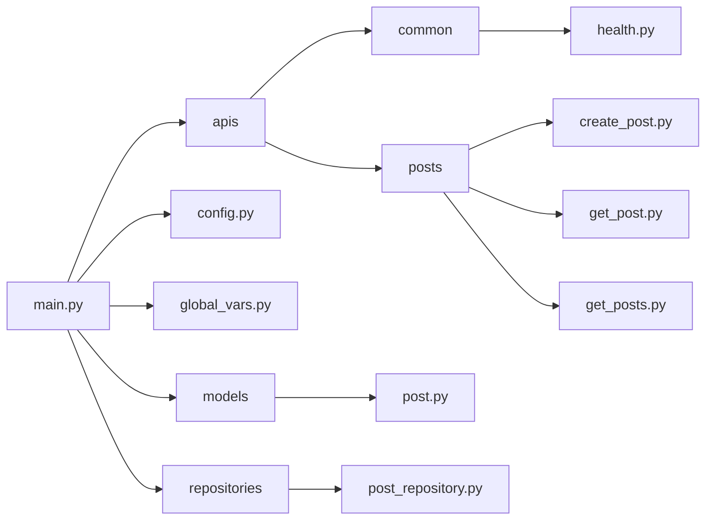

# f-lab-python-backend-project-template

F-lab Python backend project template

## Installation

### Pre-requisites

- Python 3.11 or higher
- [Poetry](https://python-poetry.org/docs/#installation)

### Install dependencies

```bash
$ make install
```

## Usage

```bash
$ make run
```

## Development

### Install dependencies

```bash
$ make install-dev
```

### Project structure



```bash
.
├── .gitignore                                    # git에서 제외할 파일들을 담은 파일
├── .pre-commit-config.yaml                       # pre-commit 설정 파일
├── Makefile                                      # 프로젝트 실행과 관련된 명령어들을 담은 파일
├── README.md                                     # 프로젝트 문서 파일
├── poetry.lock                                   # Poetry가 생성한 파일
├── pyproject.toml                                # 프로젝트 설정 파일
├── src                                           # 소스 파일들
│   ├── apis                                # API 레이어에 속하는 모듈 파일들
│   │   ├── common                    # 공통 API 모듈 파일들
│   │   │   └── health.py
│   │   └── posts                     # 게시글 API 모듈 파일들
│   │       ├── create_post.py
│   │       ├── get_post.py
│   │       └── get_posts.py
│   ├── config.py                           # 프로젝트 설정과 관련된 파일
│   ├── global_vars.py                      # 프로젝트 전역 변수들을 담은 파일
│   ├── main.py                             # 프로젝트의 시작 로직을 담은 파일
│   ├── models                              # 모델 레이어에 속하는 모듈 파일들
│   │   └── post.py
│   └── repositories                        # 레포지토리 레이어에 속하는 모듈 파일들
│       └── post_repository.py
└── tests                                         # 테스트 파일들
    └── apis                                      # API 레이어에 속하는 모듈을 테스트 하는 파일들
        ├── common                                # 공통 API 모듈을 테스트 하는 파일들
        │   └── test_health.py
        ├── conftest.py                           # 테스트에 필요한 공통 설정을 담은 파일
        └── posts                                 # 게시글 API 모듈을 테스트 하는 파일들
            ├── conftest.py
            ├── test_create_post.py
            ├── test_get_post.py
            └── test_get_posts.py
```

### Testing

```bash
$ make test
```

### Others

- 파이썬 포매팅 도구로 [black](https://github.com/psf/black), [isort](https://github.com/PyCQA/isort) 그리고 [pycln](https://github.com/hadialqattan/pycln)을 사용합니다.
  - [pre-commit](https://pre-commit.com/)을 사용하여 커밋 전에 자동으로 포매팅을 적용합니다.
  - `make format` 명령어를 사용하여 포매팅을 적용할 수 있습니다.
- [pytest](https://docs.pytest.org/)를 사용하여 테스트를 작성합니다.
  - `make test` 명령어를 사용하여 테스트를 실행할 수 있습니다.
- `make help` 명령어로 실행가능한 명령어들을 확인할 수 있습니다.
